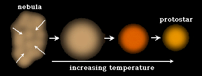

En el principio el universo que conocemos era un punto minúsculo. Dentro estaban concentrados todo el espacio, tiempo y energía.     
De repente, Big-Bang!   
El punto empezó a crecer rápidamente y al crecer creó espacio y tiempo. La energía dentro del punto se expandió en todo este nuevo espacio.

Al expandirse la energía estaba menos concentrada y consiguió dividirse en trozos independientes que llamamos partículas.
Algunas partículas tenían masa siguiendo la ecuación de Einstein:  E=MC2.

Las partículas se juntaron para formar el primer átomo, el más simple posible, llamado hidrógeno. Con el tiempo el universo se estaba llenando de átomos de hidrógeno, estos creaban nubes en el espacio. Las nubes en el espacio se llaman nébulas.
<figure>
    
    <figcaption>Fig 1: átomo de hidrógeno</figcaption>
</figure>

La fuerza de la gravedad atrajo estos átomos entre ellos y las nubes se concentraron en pelotas esféricas. En estas pelotas, la gravedad era tan fuerte que los átomos se empujaban los unos contra los otros tanto que se fusionaban. La fusión de varios átomos ligeros crea… un átomo más pesado y mucha energía que se emite al espacio. Estas pelotas que emiten energía son las estrellas.

<figure>
    
    <figcaption>Fig 2: De nébulas a estrellas</figcaption>
</figure>

La energía que se escapa de las explosiones en las estrellas la vemos como luz y también la sentimos como el calor de nuestra estrella más cercana, el sol. Las estrellas sobre todo fusionan hidrógeno en helio, pero también fusionan muchas otras cosas. Dentro de una estrella se crea carbono, oxígeno, hierro y otros materiales ahora comunes en la tierra. 

Las estrellas viven en un equilibrio entre gravedad y las explosiones de las fusiones. Cuando no pueden fusionar más átomos colapsan y a veces explotan en supernovas. Una supernova dispersa todos los materiales de una estrella como polvo y gas por el universo. Pero la gravedad vuelve a acumular este material creando una nueva generación de estrellas y también planetas.

Así es como se creó nuestro sistema solar. Una o varias estrellas explotaron por nuestra región del espacio. El hidrógeno se volvió a acumular y creó una nueva estrella: el sol. Pero el sol no absorbió todos los materiales de esta region, algunos se movían demasiado rápido en otras órbitas, y en cada órbita se creó un planeta. 

Así se creó la tierra también. Los materiales en esta órbita se acumularon en piedras pequeñas, estas piedras se juntaron en una piedra grande, que llamamos tierra, donde continuamente impactaban asteroides. Incluyendo el impacto de un asteroide gigante que lanzó tanto material y tan rápido fuera de la tierra que aún sigue allí. Lo puedes ver casi todas las noches, a este material le llamamos luna. 

[Indice](index.html)

